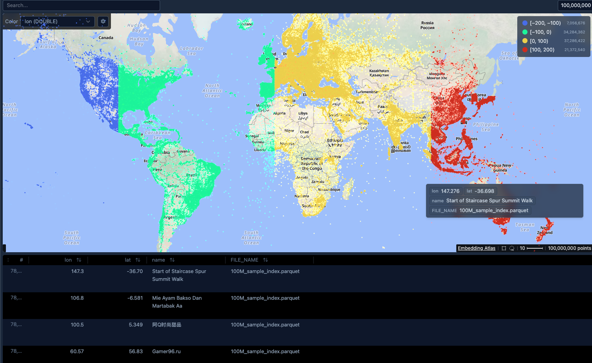
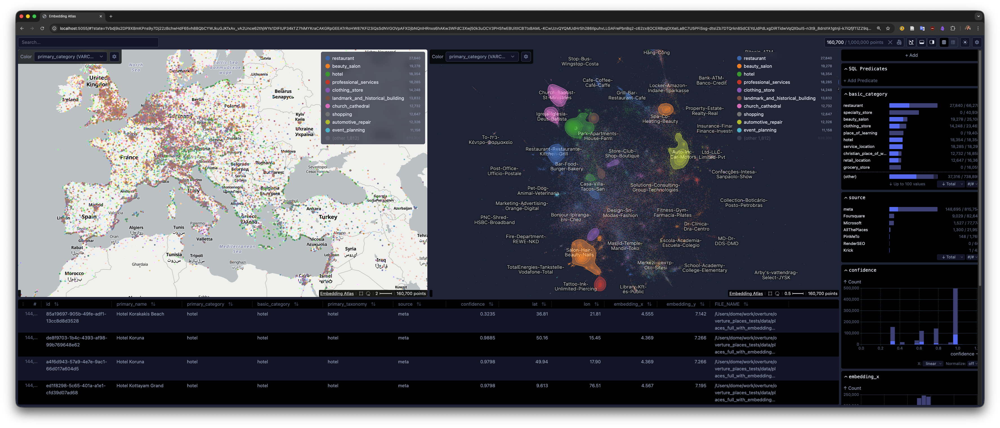
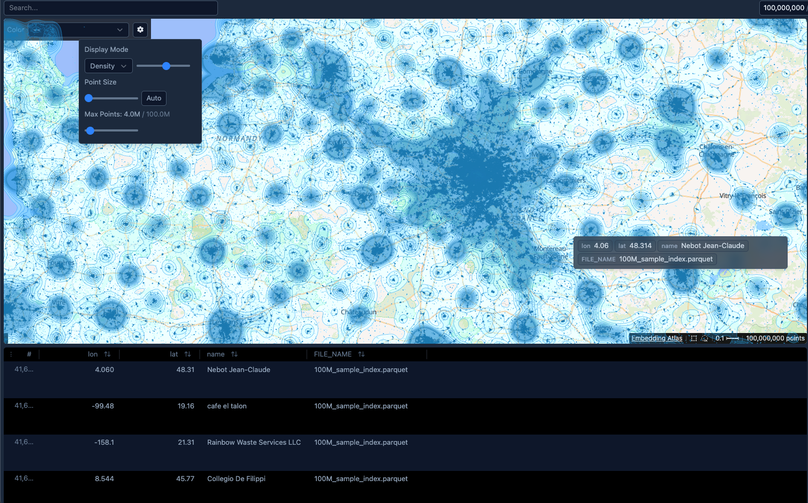
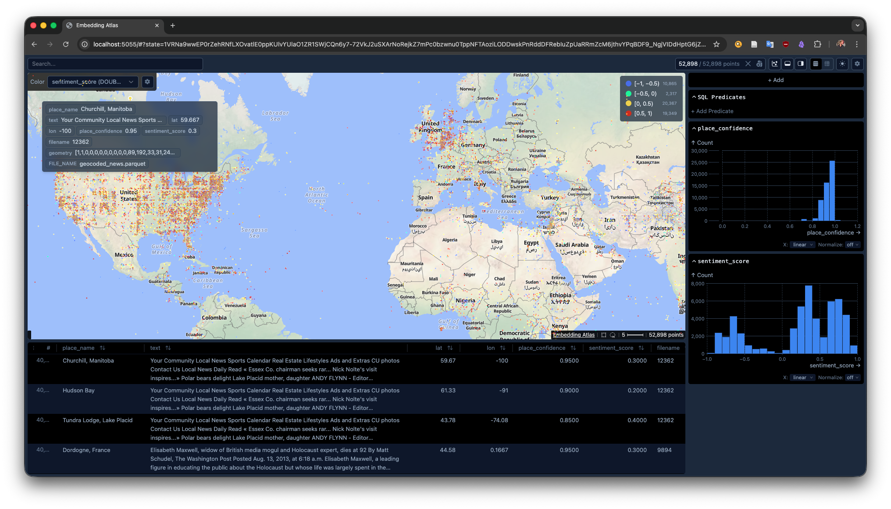
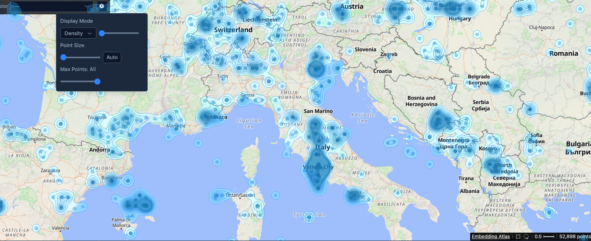
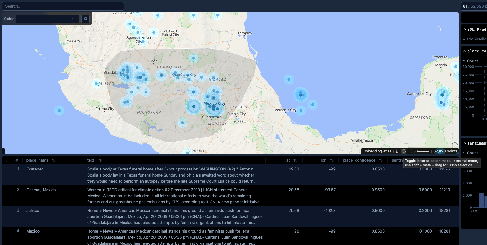

# Geospatial Atlas
This is a fork of [Embedding Atlas](https://apple.github.io/embedding-atlas) adapted for geospatial data. As embeddings or rather their 2D projections share the exact same visualization challenges like 2D geospatial data, Embedding Atlas and all its functionality serve a great deal in geospatial data exploration!

For now it's an early fork, with minimal changes to the original codebase. This repo is more of a PoC than a production-ready tool, even though it works perfectly for scatterplots even in the 100M range! Most of the original features should work but if you find a bug or anything not listed on the To-Do-Section below, please open an issue or a PR.

[LinkedIn Post for more context](https://www.linkedin.com/posts/dominik-weckm%C3%BCller_geospatial-atlas-is-born-explore-100m-points-activity-7411826555179429890-CiHX?utm_source=share&utm_medium=member_desktop&rcm=ACoAAC8q3V4BiZXfSx0JnRGDOF3d6Fzu4HdRtDE)

## Example screenshots








## Installation

```bash
git clone https://github.com/do-me/geospatial-atlas.git
cd geospatial-atlas
npm install
npm run build
```

## Usage (after installation above)

```bash
cd packages/backend
uv run embedding-atlas your_dataset_with_lat_lon_coords.parquet --text your_name_column
```

The screenshots above were created with these two datasets:
- [Foursquare 100M Places](https://huggingface.co/datasets/do-me/foursquare_places_100M), [direct download]()
- [50k poorly geocoded news](https://huggingface.co/datasets/do-me/50k_poorly_geocoded_news), [direct download](https://huggingface.co/datasets/do-me/50k_poorly_geocoded_news/resolve/main/geocoded_news.parquet)

## To Do

- Fix panning (mouse is slightly slower than canvas in North-South direction)
- Allow for zooming further in and disallow zooming out further than zoom level 0 to avoid weird effects
- Adapt density and point radius ranges
- Make basemap switchable as setting as URL
- Add basemap attribution
- Rename everything properly to "geospatial-atlas" (as I doubt that embedding-atlas project want to support geospatial data)
- Release own "geospatial-atlas" pip package?
- Test everything properly
- And much more! Feel free to open PRs!

Original Readme below.
---
[](https://www.npmjs.com/package/embedding-atlas)
[](https://pypi.org/project/embedding-atlas/)
[](https://arxiv.org/abs/2505.06386)

[](./LICENSE)

Embedding Atlas is a tool that provides interactive visualizations for large embeddings. It allows you to visualize, cross-filter, and search embeddings and metadata.

**Features**

- 🏷️ **Automatic data clustering & labeling:**
  Interactively visualize and navigate overall data structure.

- 🫧 **Kernel density estimation & density contours:**
  Easily explore and distinguish between dense regions of data and outliers.

- 🧊 **Order-independent transparency:**
  Ensure clear, accurate rendering of overlapping points.

- 🔍 **Real-time search & nearest neighbors:**
  Find similar data to a given query or existing data point.

- 🚀 **WebGPU implementation (with WebGL 2 fallback):**
  Fast, smooth performance (up to few million points) with modern rendering stack.

- 📊 **Multi-coordinated views for metadata exploration:**
  Interactively link and filter data across metadata columns.

Please visit <https://apple.github.io/embedding-atlas> for a demo and documentation.

<picture>
  <source media="(prefers-color-scheme: dark)" srcset="./packages/docs/assets/embedding-atlas-dark.png">
  
</picture>

## Get started

To use Embedding Atlas with Python:

```bash
pip install embedding-atlas

embedding-atlas <your-dataset.parquet>
```

In addition to the command line tool, Embedding Atlas is also available as a Python Notebook (e.g., Jupyter) widget:

```python
from embedding_atlas.widget import EmbeddingAtlasWidget

# Show the Embedding Atlas widget for your data frame:
EmbeddingAtlasWidget(df)
```

Finally, components from Embedding Atlas are also available in an npm package:

```bash
npm install embedding-atlas
```

```js
import { EmbeddingAtlas, EmbeddingView, Table } from "embedding-atlas";

// or with React:
import { EmbeddingAtlas, EmbeddingView, Table } from "embedding-atlas/react";

// or Svelte:
import { EmbeddingAtlas, EmbeddingView, Table } from "embedding-atlas/svelte";
```

For more information, please visit <https://apple.github.io/embedding-atlas/overview.html>.

## BibTeX

For the Embedding Atlas tool:

```bibtex
@misc{ren2025embedding,
  title={Embedding Atlas: Low-Friction, Interactive Embedding Visualization},
  author={Donghao Ren and Fred Hohman and Halden Lin and Dominik Moritz},
  year={2025},
  eprint={2505.06386},
  archivePrefix={arXiv},
  primaryClass={cs.HC},
  url={https://arxiv.org/abs/2505.06386},
}
```

For the algorithm that automatically produces clusters and labels in the embedding view:

```bibtex
@misc{ren2025scalable,
  title={A Scalable Approach to Clustering Embedding Projections},
  author={Donghao Ren and Fred Hohman and Dominik Moritz},
  year={2025},
  eprint={2504.07285},
  archivePrefix={arXiv},
  primaryClass={cs.HC},
  url={https://arxiv.org/abs/2504.07285},
}
```

## Development

This repo contains multiple sub-packages:

Frontend:

- `packages/component`: The `EmbeddingView` and `EmbeddingViewMosaic` components.

- `packages/table`: The `Table` component.

- `packages/viewer`: The frontend application for visualizing embedding and other columns. It also provides the `EmbeddingAtlas` component that can be embedded in other applications.

- `packages/density-clustering`: The density clustering algorithm, written in Rust.

- `packages/umap-wasm`: An implementation of UMAP algorithm in WebAssembly (with the [umappp](https://github.com/libscran/umappp) C++ library).

- `packages/embedding-atlas`: The `embedding-atlas` package that get published. It imports all of the above and exposes their API in a single package.

Python:

- `packages/backend`: A Python package named `embedding-atlas` that provides the `embedding-atlas` command line tool.

Documentation:

- `packages/docs`: The documentation website.

For more information, please visit <https://apple.github.io/embedding-atlas/develop.html>.

## License

This code is released under the [`MIT license`](LICENSE).
