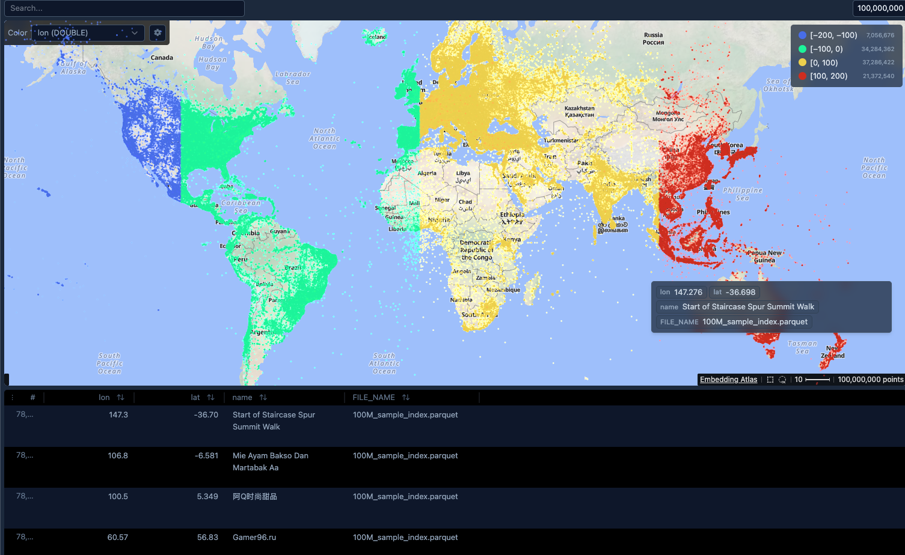
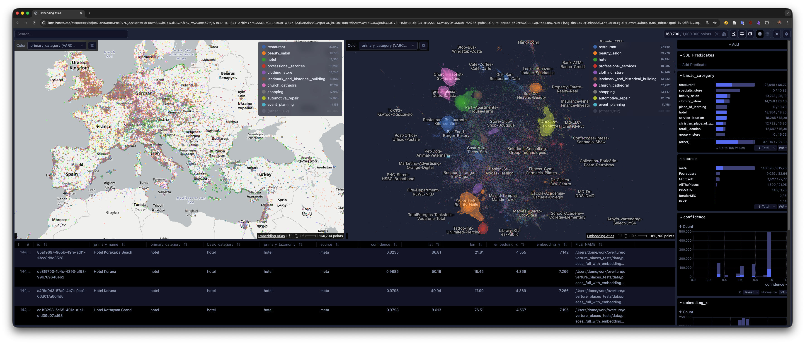
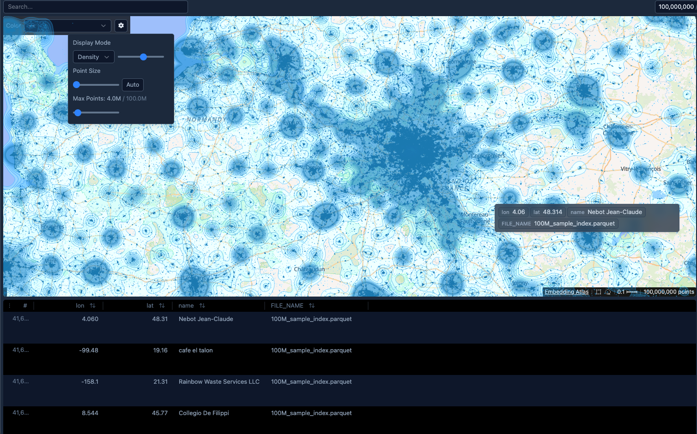
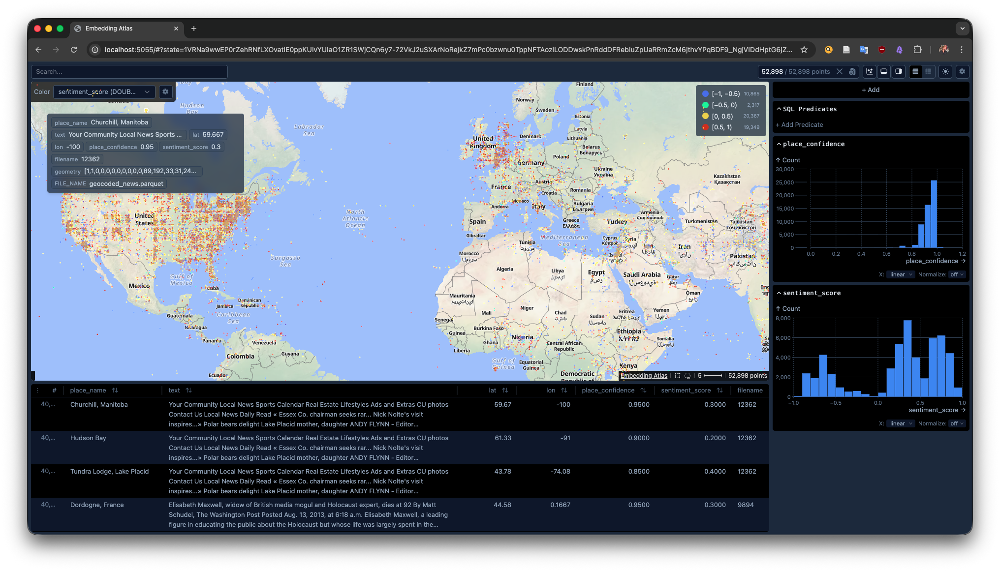
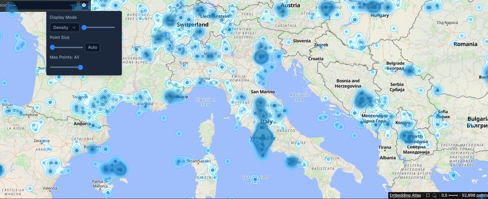
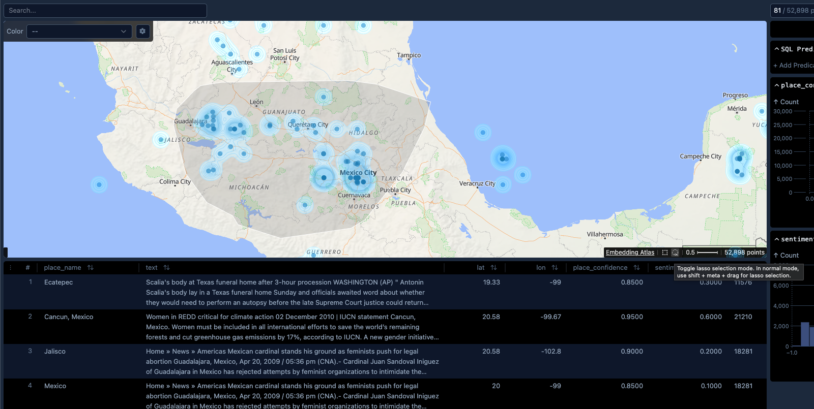
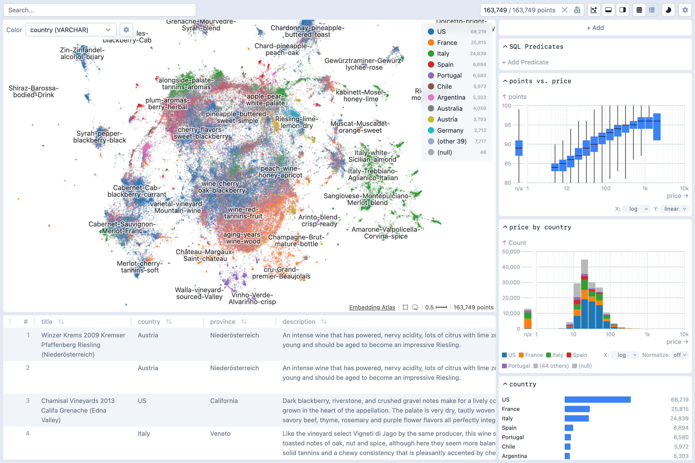

# Geospatial Atlas
This is a fork of [Embedding Atlas](https://apple.github.io/embedding-atlas) adapted for geospatial data. As embeddings or rather their 2D projections share the exact same visualization challenges like 2D geospatial data, Embedding Atlas and all its functionality serve a great deal in geospatial data exploration!

It can **visualize up to ~200M points** in your WebGPU-enabled browser! Make sure to use Chrome, Safari or activate the flag in Firefox.

Find various example apps [here](https://github.com/do-me/geospatial-atlas-apps). Try for example the [6M GlobalGeoTree explorer](https://do-me.github.io/geospatial-atlas-apps/GlobalGeoTree/)! Load your own data (up to around 6M points) here: https://do-me.github.io/geospatial-atlas/app/!

[LinkedIn Post for more context](https://www.linkedin.com/posts/dominik-weckm%C3%BCller_geospatial-atlas-is-born-explore-100m-points-activity-7411826555179429890-CiHX?utm_source=share&utm_medium=member_desktop&rcm=ACoAAC8q3V4BiZXfSx0JnRGDOF3d6Fzu4HdRtDE)

## Example screenshots








## Installation

```bash
git clone https://github.com/do-me/geospatial-atlas.git
cd geospatial-atlas
npm install
npm run build
```

Running on an Intel Mac? Then add this line to `packages/backend/pyproject.toml`:

`required-environments = ["sys_platform == 'darwin' and platform_machine == 'x86_64'"]`

For Windows, Silicon Macs and Linux everything should work out of the box.

## Usage (after installation above)

Currently the parquet files require both a `lat` (or latitude) and `lon` (or longitude) column. A Geometry column is not being parsed at the moment (but can be implemented fairly easily with DuckDB spatial). Preprocessing with DuckDB is recommended.

Execute this command directly from the root directory of the repository.
```bash
uv --directory packages/backend run geospatial-atlas your_dataset_with_lat_lon_coords.parquet
```

If you have a small dataset (<5M places) you can add the `--text` flag to include a text column. Your names are then indexed and searchable. For large files this might cause out-of-memory errors.

```bash
uv --directory packages/backend run geospatial-atlas your_dataset_with_lat_lon_coords.parquet --text your_name_column
```

Alternatively you can cd into the backend folder and run it from there:
```
cd packages/backend
uv run geospatial-atlas your_dataset_with_lat_lon_coords.parquet --text your_name_column
```

The screenshots above were created with these two datasets:
- [Foursquare 100M Places](https://huggingface.co/datasets/do-me/foursquare_places_100M), [direct download]()
- [50k poorly geocoded news](https://huggingface.co/datasets/do-me/50k_poorly_geocoded_news), [direct download](https://huggingface.co/datasets/do-me/50k_poorly_geocoded_news/resolve/main/geocoded_news.parquet)

## Build & Deploy GitHub Pages

The static web app is deployed manually (no CI). To rebuild and deploy:

```bash
# 1. Install dependencies (first time only)
npm install

# 2. Build all packages (utils, component, table, viewer, docs)
npm run build

# 3. Deploy the built site to the gh-pages branch
./scripts/deploy-gh-pages.sh
```

Then in GitHub → Settings → Pages, set the source to the `gh-pages` branch (root `/`).

The live site is available at: https://do-me.github.io/geospatial-atlas/

## Testing

End-to-end tests use [Playwright](https://playwright.dev/) and cover both runtime modes (server mode with Python backend, and frontend-only mode with Vite dev server + DuckDB WASM).

**Prerequisites:**

```bash
npm run build              # server-mode tests need the built viewer
npx playwright install chromium
```

On first run the test suite auto-downloads a ~29 MB parquet fixture ([GISCO Education](https://github.com/do-me/geospatial-atlas-apps/tree/main/GISCO_Education)) and caches it in `e2e/.data/` (git-ignored). Override with `E2E_PARQUET_FILE=/path/to/file.parquet` if needed.

**Run all tests:**

```bash
npx playwright test
```

**Run a single mode:**

```bash
npx playwright test --project server-mode
npx playwright test --project frontend-mode
```

**View the HTML report** (generated on every run):

```bash
npx playwright show-report e2e/playwright-report
```

Test artifacts (traces, screenshots on failure, HTML report) are written to `e2e/test-results/` and `e2e/playwright-report/` — both git-ignored.

### Test structure

```
e2e/
├── helpers.ts                # Auto-download, server lifecycle, page helpers
├── server-mode.spec.ts       # Full-stack: Python backend + pre-built viewer
│   ├── API                   #   Metadata endpoint, DuckDB query
│   ├── Rendering             #   Scatter canvas, MapLibre basemap, sidebar
│   ├── Basemap Alignment     #   Mercator formula, point-vs-map consistency
│   ├── Interaction           #   Scroll-to-zoom
│   └── Zoom Drift            #   Scatter-vs-map pixel alignment across zoom levels
└── frontend-mode.spec.ts     # Browser-only: Vite dev server + DuckDB WASM
    ├── File Upload           #   Drop zone, parquet upload transition
    └── Test Data Viewer      #   Synthetic data scatter, UI controls
```

## To Do

- Disallow zooming out further than zoom level 0 to avoid weird shifting effects
- Adapt density and point radius ranges
- Add basemap attribution
- Release own "geospatial-atlas" pip package?
- And much more! Feel free to open PRs!

---

## Original Embedding Atlas Readme

[](https://www.npmjs.com/package/embedding-atlas)
[](https://pypi.org/project/embedding-atlas/)
[](https://arxiv.org/abs/2505.06386)
[](./LICENSE)

Embedding Atlas is a tool that provides interactive visualizations for large embeddings. It allows you to visualize, cross-filter, and search embeddings and metadata.

**Features**

- 🏷️ **Automatic data clustering & labeling:**
  Interactively visualize and navigate overall data structure.

- 🫧 **Kernel density estimation & density contours:**
  Easily explore and distinguish between dense regions of data and outliers.

- 🧊 **Order-independent transparency:**
  Ensure clear, accurate rendering of overlapping points.

- 🔍 **Real-time search & nearest neighbors:**
  Find similar data to a given query or existing data point.

- 🚀 **WebGPU implementation (with WebGL 2 fallback):**
  Fast, smooth performance (up to few million points) with modern rendering stack.

- 📊 **Multi-coordinated views for metadata exploration:**
  Interactively link and filter data across metadata columns.

Please visit <https://apple.github.io/embedding-atlas> for a demo and documentation.

<picture>
  <source media="(prefers-color-scheme: dark)" srcset="./packages/docs/public/assets/embedding-atlas-dark.png">
  
</picture>

## Get started

To use Embedding Atlas with Python:

```bash
pip install embedding-atlas

embedding-atlas <your-dataset.parquet>
```

In addition to the command line tool, Embedding Atlas is also available as a Python Notebook (e.g., Jupyter) widget:

```python
from embedding_atlas.widget import EmbeddingAtlasWidget

# Show the Embedding Atlas widget for your data frame:
EmbeddingAtlasWidget(df)
```

Finally, components from Embedding Atlas are also available in an npm package:

```bash
npm install embedding-atlas
```

```js
import { EmbeddingAtlas, EmbeddingView } from "embedding-atlas";

// or with React:
import { EmbeddingAtlas, EmbeddingView } from "embedding-atlas/react";

// or Svelte:
import { EmbeddingAtlas, EmbeddingView } from "embedding-atlas/svelte";
```

For more information, please visit <https://apple.github.io/embedding-atlas/overview.html>.

## BibTeX

For the Embedding Atlas tool:

```bibtex
@misc{ren2025embedding,
  title={Embedding Atlas: Low-Friction, Interactive Embedding Visualization},
  author={Donghao Ren and Fred Hohman and Halden Lin and Dominik Moritz},
  year={2025},
  eprint={2505.06386},
  archivePrefix={arXiv},
  primaryClass={cs.HC},
  url={https://arxiv.org/abs/2505.06386},
}
```

For the algorithm that automatically produces clusters and labels in the embedding view:

```bibtex
@misc{ren2025scalable,
  title={A Scalable Approach to Clustering Embedding Projections},
  author={Donghao Ren and Fred Hohman and Dominik Moritz},
  year={2025},
  eprint={2504.07285},
  archivePrefix={arXiv},
  primaryClass={cs.HC},
  url={https://arxiv.org/abs/2504.07285},
}
```

## Development

For development instructions, please visit <https://apple.github.io/embedding-atlas/develop.html>, or checkout `packages/docs/develop.md`.

## License

This code is released under the [`MIT license`](LICENSE).
